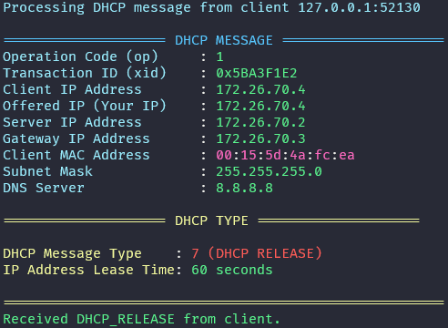

# DHCP_Server

## Content Table
- [Developers](#developers)
- [Introduction](#introduction)
- [Development](#development)
- [Milestones Achieved and Not Achieved](#milestones-achieved-and-not-achieved)
  - [Server](#server)
  - [Client](#client)
  - [Additional Features](#additional-features)
- [Project Structure](#project-structure)
- [Execution](#execution)
- [References](#references)
- [License](#license)
- [Contact](#contact)

## Developers
- [Juan Felipe Restrepo Buitrago](https://github.com/JuanFelipeRestrepoBuitrago)
- [Kevin Quiroz González](https://github.com/KevinQzG)
- [Jacobo Zuluaga](https://github.com/jacobozj)

## Introduction

This project involves the development of a functional DHCP server and client in C. The server dynamically assigns IPv4 addresses and network parameters to clients within a local or remote network using the Berkeley Sockets API.

The Dynamic Host Configuration Protocol (DHCP) is a network protocol used to assign IP addresses and provide configuration information to devices on a network. The DHCP server is responsible for managing a pool of IP addresses and assigning them to clients that request them. The server also provides additional network parameters such as the subnet mask, default gateway, and DNS server.

The process of assigning an IP address to a client involves the following steps: 

- **1. DHCP Discover**: The client sends a broadcast message to the network requesting an IP address.
- **2. DHCP Offer**: The server responds with a broadcast message offering an IP address to the client.
- **3. DHCP Request**: The client sends a broadcast message requesting the offered IP address.
- **4.1. DHCP Acknowledge**: The server responds with a broadcast message acknowledging the IP address assignment.
- **4.2. DHCP Nak**: The server responds with a broadcast message denying the IP address assignment.
- **5. IP Address Lease**: The client uses the assigned IP address for a specified period of time and then renews the lease sending a new request to the server.
- **6. IP Address Release**: The client releases the IP address when it is no longer needed.

## Development

At the beginning of the project, the team defined the project structure and  the features that the server and client should have. Additionally, we look for information in the internet about the Berkeley Sockets API and the DHCP protocol to understand how to implement the server and client. We first understood the basic concepts and functionality of the DHCP protocol, such as the DHCP message structure, the different types of messages, and the options that can be included in the messages.

After understanding the DHCP protocol and what processes the server and client should perform, we started the implementation of the server and client. To work on the project, we divided the tasks among the team members according to their available time and skills. We used the C programming language to implement the server and client, and the Berkeley Sockets API to establish communication between the server and client.

The server and client were implemented using the following steps:

- **1. Server Initialization**: A simple UDP socket was created to listen for incoming DHCP messages from clients.
- **2. Client Initialization**: A simple UDP socket was created to send DHCP messages to the server.
- **3. Environment Configuration**: The server and client were configured to read environment variables from a `.env` and a `.env.client` file, respectively.
- **4. Message Structure**: The DHCP message structure was defined to include the different fields and options required by the protocol.
- **5. IP Pool Management**: A pool of IP addresses was added to the server to assign to clients requesting an IP address.
- **6. DHCP Message Handling**: The server and client were implemented to handle the different types of DHCP messages (Discover, Offer, Request, Acknowledge, Nak).
- **7. IP Address Assignment**: A mechanism was implemented to assign an IP address to a client requesting an IP address.
- **8. IP Address Lease**: The server was implemented to lease an IP address to a client for a specified period of time. Renewal and release of the IP address were also implemented first for server and then for client.
- **9. Server and Client Execution**: The server and client were implemented to run as separate processes and communicate with each other using the Berkeley Sockets API.
- **10. Broadcast Messages**: The server and client were implemented to send and receive broadcast messages to communicate with each other within a local network.
- **11. Testing**: The server and client were tested to verify that they were working correctly and assigning IP addresses to clients as expected.
- **12. AWS EC2 Deployment**: The server and client were deployed on AWS EC2 instances to test communication between a local server and a remote client.

## Milestones Achieved and Not Achieved

We managed to implement the server and client to assign IP addresses to clients using the DHCP protocol. Both applications were implemented in C language using the Berkeley Sockets API to establish communication between the server and client.

They work as expected, where the server assigns IP addresses to clients that request them, and the client receives the assigned IP address and network parameters from the server. Below are the milestones achieved during the development of the project:

### Server
- [x] **Server Listening**: The server listens for incoming DHCP messages from clients on a UDP socket, both on local and remote networks.
- [x] **IP Address Assignment**: The server dynamically assigns IP addresses to clients from a pool of available IP addresses when requested.
- [x] **IP Pool Management**: The server manages a pool of IP addresses created from a range of IPs defined by the user through environment variables.
- [x] **IP Address Lease Management**: The server leases an IP address to a client for a specified period. It handles the renewal and release of the IP address either when the client requests it or when the lease expires.
- [x] **Simultaneous Clients**: The server supports multiple clients simultaneously by using threads to process incoming DHCP messages from clients concurrently.
- [x] **DHCP Message Handling**: The server processes the primary DHCP message types, including Discover, Offer, Request, Acknowledge, Nak, and prints the received messages for logging purposes.

- [x] **IP Lease Logging**: The server logs every assigned IP address, along with the lease time and client details, for future reference.
- [x] **Error Management**: The server handles errors gracefully by printing error messages and exiting the program when an error occurs or sending a Nak message to the client when the IP address assignment fails.
- [ ] **Cross-Subnet Client Handling**: _Not achieved_. The server currently does not support handling requests from clients in different subnets via a DHCP relay or at least we don't have a clear way to test and know if it works.

### Client

- [x] **Client Implementation**: We manage to implement a client in C language. 
- [x] **Requesting IP Address**: The client sends a DHCP Discover message to the server to request an IP address.
- [x] **Receiving IP Address**: The client receives an IP address and network parameters from the server in a DHCP Offer message. Furthermore, the client prints the received IP address and network parameters in the console. The elements printed are: the client IP address, the offered IP address, the server IP address, the subnet mask, the default gateway, the DNS server and the client MAC address.

- [x] **IP Address Lease Management**: The client manages the lease of the assigned IP address by renewing the lease with the server when the lease time is about to expire.
- [x] **IP Address Release**: The client releases the assigned IP address when it is no longer needed by sending a DHCP Release message to the server. The Release message is sent when the execution of the client is finished. 

### Additional Features

- [x] **Server and Client Broadcast Messages**: The server and client communicate with each other using broadcast messages to send and receive DHCP messages within a local network.
- [x] **RELEASE and NAK Messages**: The client sends a RELEASE message to the server when it is finished executing to release the assigned IP address. The server sends a NAK message to the client when the IP address assignment fails.

## Project Structure

.   
├── src \ # Source files    
|   ├── config/ # Configuration files   
|   |   ├── env.c # Environment configuration file  
|   |   └── env.h # Environment configuration header file   
|   ├── data/ # Data files  
|   |   ├── ip_pool.c # Management of the IP pool   
|   |   ├── ip_pool.h # IP pool header file     
|   |   ├── message.c # Management of the DHCP messages and its structure   
|   |   └── message.h # DHCP message header file    
|   ├── utils/ # Utility files  
|   |   ├── utils.c # Utility functions 
|   |   └── utils.h # Utility header file   
|   ├── client.c # Client source code   
|   ├── server.c # Server source code   
|   ├── client.h # Client header file   
|   └── server.h # Server header file   
├── .env.example # Environment variables template   
├── client.sh # Client execution script     
├── server.sh # Server execution script     
├── .gitignore # Git ignore file    
├── README.md # Project README file     
└── LICENSE # Project license file      

## Execution

1. **Environment Configuration**: Make sure you have C, the GCC compiler installed on your machine. If not, you can install it by running the following command:

```bash
sudo apt-get install gcc
```

2. **Clone the Repository**: Clone the repository to your local machine.


4. **Project's Root Directory**: Navigate to the project's root directory.

3. **.env File Configuration**: Make sure you have the `.env` file for server and `.env.client` for client configured with the desired environment variables in the project root directory. You can use the template in the `.env.example` file.

2. **Server Execution**: To run the server, run the following command:

```bash
./server.sh
```

3. **Client Execution**: To run the client, run the following command:

```bash
./client.sh
```

## References

- [Berkeley Sockets API](https://en.wikipedia.org/wiki/Berkeley_sockets)
- [Dynamic Host Configuation Protocol (DHCP) Message Options](https://www.omnisecu.com/tcpip/dhcp-dynamic-host-configuration-protocol-message-options.php#:~:text=Message%20Type%20indicates%20the%20DHCP%20message%20and%20can,Dynamic%20Host%20Configuration%20Protocol%20%28DHCP%29%20Request%20message%20%28DHCPRequest%29.)

## License

This project is licensed under the GNU General Public License v3.0 - see the [LICENSE](LICENSE) file for details.

## Contact

For any questions or issues, feel free to reach out to:
- Juan Felipe Restrepo Buitrago: [jfrestrepb@eafit.edu.co](mailto:jfrestrepb@eafit.edu.co)
- Kevin Quiroz González: [kquirozg@eafit.edu.co](mailto:kquirozg@eafit.edu.co)
- Jacobo Zuluaga: [manin@eafit.edu.co](mailto:manin@eafit.edu.co)